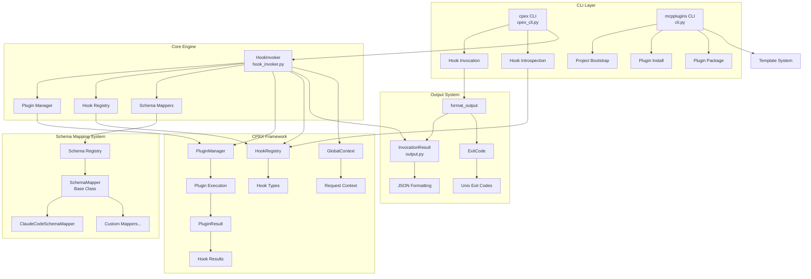
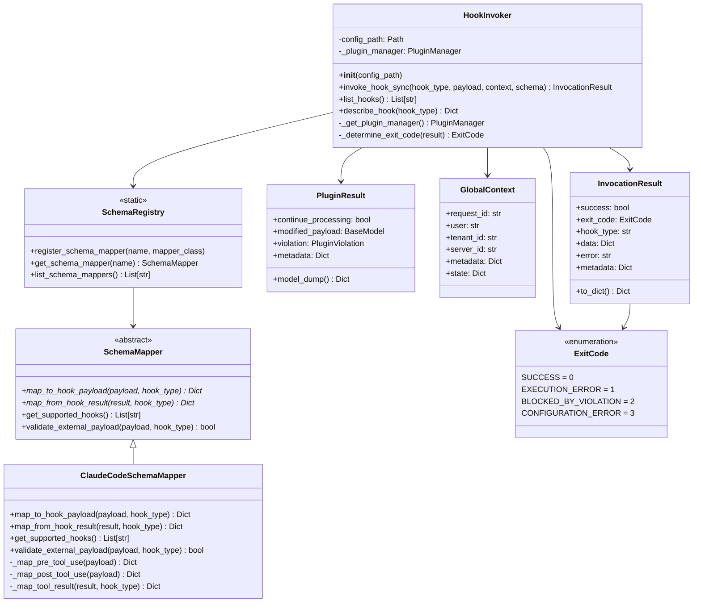
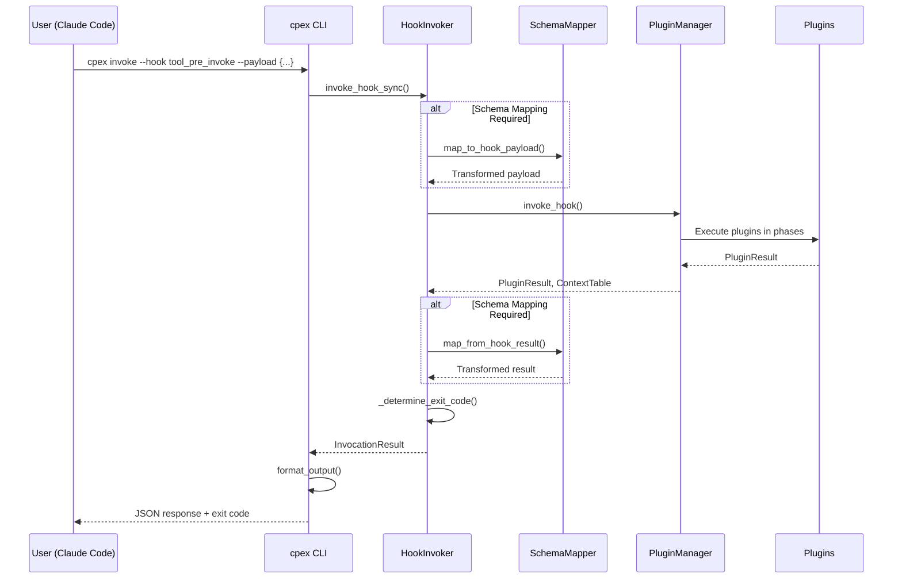

# CPEX CLI Tools

This module provides command-line interfaces for the CPEX (ContextForge Plugin Extensibility Framework) system, enabling both plugin users and developers to interact with the framework effectively.

## Overview

The CLI tools consist of two main components:

1. **`cpex` CLI**: Hook invocation and introspection for plugin users
2. **`mcpplugins` CLI**: Plugin development and bootstrapping tools

## Architecture



## Class Hierarchy



## Data Flow



## Features

### 🔧 **Hook Invocation (`cpex invoke`)**
- Execute any registered hook with JSON payloads
- Support for file-based or inline JSON input
- Global context injection for request metadata
- Schema mapping for external tool integration
- Verbose logging and error reporting

### 🔍 **Hook Introspection (`cpex hooks`)**
- **`cpex hooks list`**: List all registered hook types
- **`cpex hooks describe <hook>`**: Show detailed schema information

### 🏗️ **Plugin Development (`mcpplugins`)**
- **`mcpplugins bootstrap`**: Create new plugin projects from templates
- Support for native Python and external plugin templates
- Git-based template system with version control

### 🔄 **Schema Mapping**
- Transform external tool payloads to CPEX format
- Extensible registry for custom schema mappers
- Built-in Claude Code integration
- Bidirectional payload transformation

## Usage Examples

### Basic Hook Invocation
```bash
# Simple tool invocation
cpex invoke --hook tool_pre_invoke --payload '{"name": "search", "args": {"query": "test"}}'

# With custom context
cpex invoke --hook tool_pre_invoke \
  --payload '{"name": "search", "args": {"query": "test"}}' \
  --context '{"request_id": "req-123", "user": "alice"}'

# From files
cpex invoke --hook tool_pre_invoke \
  --payload ./payload.json \
  --context ./context.json
```

### Claude Code Integration
```bash
# Transform Claude Code payload format
cpex invoke --hook tool_pre_invoke \
  --payload '{"tool_name": "search", "arguments": {"query": "test"}}' \
  --schema claude-code
```

### Hook Introspection
```bash
# List all available hooks
cpex hooks list

# Get detailed schema for a hook
cpex hooks describe tool_pre_invoke

# Verbose listing with metadata
cpex hooks list --verbose
```

### Plugin Development
```bash
# Create new native plugin project
mcpplugins bootstrap --destination ./my-plugin --template_type native

# Create external plugin project
mcpplugins bootstrap --destination ./my-external-plugin --template_type external

# Use specific template version
mcpplugins bootstrap --destination ./my-plugin --vcs_ref v1.2.0
```

## Configuration

### Environment Variables
- `PLUGINS_CLI_COMPLETION`: Enable auto-completion (default: false)
- `PLUGINS_CLI_MARKUP_MODE`: Set markup mode (rich/markdown/disabled)

### Configuration Files
- Plugin configuration via YAML files with `--config` option
- Template customization through cookiecutter variables
- Schema mapper registration through Python imports

## Exit Codes

| Code | Meaning | Description |
|------|---------|-------------|
| 0 | SUCCESS | Hook executed successfully, continue processing |
| 1 | EXECUTION_ERROR | Hook execution failed due to error |
| 2 | BLOCKED_BY_VIOLATION | Hook executed but blocked processing due to violation |
| 3 | CONFIGURATION_ERROR | Configuration, validation, or CLI usage error |

## Extension Points

### Custom Schema Mappers
```python
from cpex.tools.schemas.base import SchemaMapper, register_schema_mapper

class MyToolSchemaMapper(SchemaMapper):
    def map_to_hook_payload(self, external_payload, hook_type):
        # Transform external payload to CPEX format
        return {"name": external_payload["tool_name"], "args": external_payload.get("params", {})}

    def map_from_hook_result(self, hook_result, hook_type):
        # Transform CPEX result to external format
        return {"success": hook_result.continue_processing, "data": hook_result.model_dump()}

# Register the mapper
register_schema_mapper("my-tool", MyToolSchemaMapper)
```

### Plugin Templates
- Add custom templates to the template repository
- Support for both native Python and external plugin types
- Cookiecutter-based templating with variable substitution

## Dependencies

- **Core**: FastAPI, Pydantic, PyYAML, httpx
- **CLI**: typer (rich formatting, auto-completion)
- **Templates**: cookiecutter (optional, for `mcpplugins bootstrap`)
- **Framework**: All CPEX framework components

## Installation

The CLI tools are automatically available when installing CPEX with the `cli` extra:

```bash
pip install cpex[cli]

# Or for development
pip install cpex[cli,dev]
```

Console scripts are registered as:
- `cpex` → `cpex.tools.cpex_cli:main`
- `mcpplugins` → `cpex.tools.cli:main`